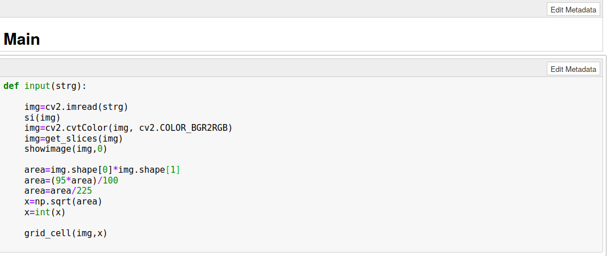
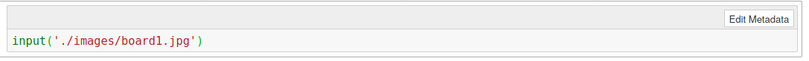
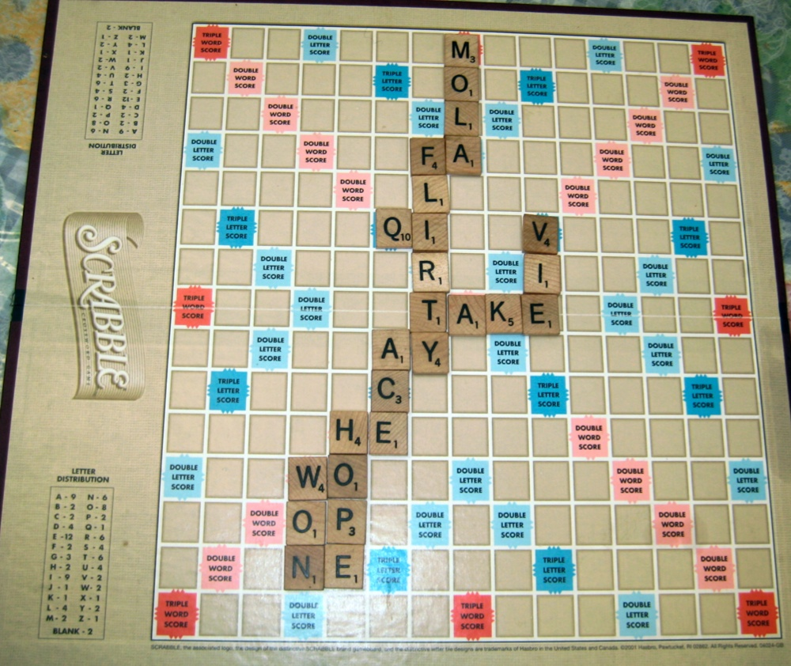
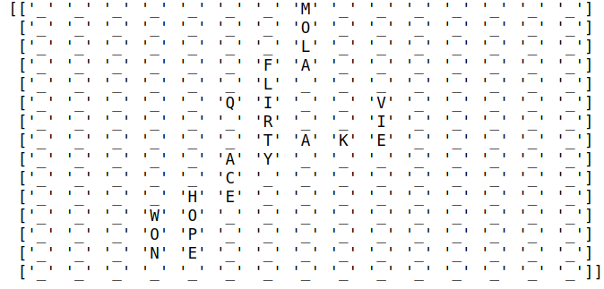

# Scrabble Assistant

## About Scrabble
Scrabble is a commonly played word game in which players take turns forming words using a set of seven letter tiles and placing them onto a grid, following placement rules similar to a crossword puzzle.

## Overview
Scrabble Assistant is a feature that allows developers to work on computing the score, hint generation, possible words that can be formed by taking the image of Scrabble board as an input.

## Prerequistes
Before you begin, ensure you have met the following requirements:
* Install python with version >=3.6
* Install pip3 using  `sudo apt-get install python3-pip`
* Install virtual environment as we will be installing some packages and to separate them from your other projects virtual environment is a good option  `sudo pip3 install virtualenv`
* Install Jupyter notebook with latest version using  `pip3 install notebook`

## Installations
Follow these steps in the given order in order to avoid any problem
* Clone this repo on your machine using  `git clone https://github.com/Digital-Image-Processing-IIITH/project-fmss`
* Change your current directory using  `cd project-fmss`
* Create a new virtual environment using `virtualenv <name/of/virtual/environment>` let's say it is `scrab` then use  `virtualenv scrab`
* Activating the virtual environment using  `source scrab/bin/activate`
* Install all the required packages using   `sudo pip3 install -r requirements.txt`
* Now open notebook using   `jupyter notebook`

## Running the Notebook
* Run all the cells present in the notebook
* In the below image input function is shown which is present in the 2nd last cell of notebook to which we have to pass the address of the input image

* After that in the last cell which is empty call the input function with the parameter as address to the input image

## Result

### Input

### Output

For other input images https://drive.google.com/file/d/1Ji-DafWIyyvWR6CDmDnWMvWhRL33oEiW/view
and corresponding output images https://drive.google.com/file/d/1cTDjiHJ46JEw1gtKElbfoXyy43kBZQBN/view

